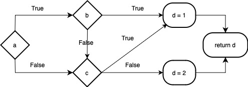

# 短路求值

## 介绍
逻辑与和逻辑或操作符总是先计算其左操作数，然后再计算其右操作数。只有在仅靠左操作数的值无法确定该逻辑表达式的结果时，才会求解其右操作数。我们常常称这种求值策略为“短路求值（short-circuit evaluation）”。

## 我们为什么要这样做呢？
最直观的好处就是：能够通过左操作数就确定逻辑表达式的结果，降低了程序计算量，提高程序效率。

除此之外，在某些情况下，避免对表达式的第二部分求值可以防止潜在的错误或异常，比如在C++中，对于如下代码：
```cpp
int *p = nullptr;
/*... */
if (p && *p) { /*... */ }
/*... */
```
在这个例子中，如果`p`为`nullptr`，那么`*p`将会导致错误。而如果我们使用短路求值，那么在`p`为`nullptr`时，`*p`不会被求值，直接跳过`*p`的计算，从而避免了错误。

当然，在我们的 MiniDecaf 中，并不支持指针，但是逻辑表达式是否为短路求值仍然有可能对程序的含义产生影响，例如：
```c
int main() {
    int a = 0;
    if (a && (a = 1)) {
        return a;
    }
    return a;
}
```
在这个例子中，如果没有短路求值，最终`a`应该为`1`；如果使用短路求值，就不会到达`a = 1`，此时`a`的值为`0`。

## 我们如何实现短路求值呢？
首先我们要知道，只有在出现了`&&`或`||`时，才会使用短路求值。当 `&&` 的第一个运算数的值为 false 时，其结果必定为 false；当 `||` 的第一个运算数为 true 时，最后结果必定为 true，在这种情况下，就不需要知道第二个运算数的具体值。

具体的实现方法有`跳转法`和`拉链与代码回填（backpatching）`，这里我们只讲解`跳转法`。同时，要注意逻辑表达式不仅出现在条件判断中，因此我们分以下两种情况考虑：

### 用于条件判断
对于下面这个例子：
```c
int main() {
    int a = 1, b = 2, c = 3, d = 4;
    if (a && b || c) {
        d = 1;
    }
    else {
        d = 0;
    }
    return d;
}
```
`if`部分的流程图应该如下所示：（别忘了`&&`和`||`的优先级）


上述代码转化为IR后可能如下：
```
i32 main() {
_B0:
  alloca i32* _T0 = 4   # a
  i32 _T1 = 1
  store *(i32* _T0 + 0) = i32 _T1
  alloca i32* _T2 = 4   # b
  i32 _T3 = 2
  store *(i32* _T2 + 0) = i32 _T3
  alloca i32* _T4 = 4   # c
  i32 _T5 = 3
  store *(i32* _T4 + 0) = i32 _T5
  alloca i32* _T6 = 4
  i32 _T7 = 4
  store *(i32* _T6 + 0) = i32 _T7
  load i32 _T8 = *(i32* _T0 + 0)
  if i32 _T8 == 0 jump _B4 else jump _B5   # 判断a
_B1:
  i32 _T11 = 1
  store *(i32* _T6 + 0) = i32 _T11  # d = 1
  jump _B3
_B2:
  i32 _T12 = 0
  store *(i32* _T6 + 0) = i32 _T12  # d = 0
  jump _B3
_B3:
  load i32 _T13 = *(i32* _T6 + 0)
  return i32 _T13   # return d
_B4:
  load i32 _T10 = *(i32* _T4 + 0)
  if i32 _T10 == 0 jump _B2 else jump _B1   # 判断c
_B5:
  load i32 _T9 = *(i32* _T2 + 0)
  if i32 _T9 == 0 jump _B4 else jump _B1   # 判断b
}
```
你可以参考上述 IR 中的分支跳转指令，思考如何使用跳转指令来实现短路求值。

### 非条件判断
上一部分是逻辑表达式为条件语句的情况，那如果逻辑表达式不用于条件判断呢？例如：
```c
int main() {
    int a = 1, b = 2, c = 3, d = 2;
    d = a && b || c;
    return d;
}
```
一种思路是把它当成`if`语句来处理：
```c
int main() {
    int a = 1, b = 2, c = 3, d = 4;
    if (a && b || c) {
        d = 1;
    }
    else {
        d = 0;
    }
    return d;
}
```
最终可以得到与前一个例子同样的IR。