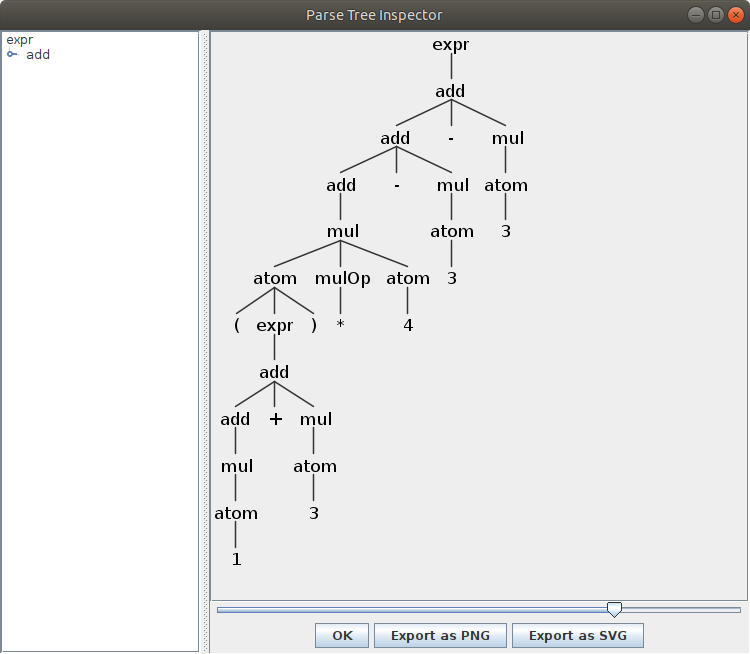

# ANTLR 使用——以表达式语法为例
使用 ANTLR 工具，我们只需要写出词法和语法分析的 **规范（specification）**，
然后它会帮我们生成 lexer 和 parser 乃至 visitor，非常方便。

我们用一个简单的表达式语法 [^1] 来介绍 ANTLR，表达式由一系列整数通过加减乘除以及括号构成，例如 `(1+3)*4-3-3`。

对于 ANTLR，词法和语法分析的规范都写在 .g4 [^2] 文件中，例如我们的表达式的规范是[文法: ExprLex.g4](https://github.com/decaf-lang/minidecaf-tutorial-code/blob/master/step1/ExprLex.g4)和[语法: Expr.g4](https://github.com/decaf-lang/minidecaf-tutorial-code/blob/master/step1/Expr.g4)。
无论是词法规范还是语法规范，它们的规范文件结构是一样的，如下。

> 规范文件中，`//` 表示注释，规范是大小写敏感的，字符串常量用单引号括起。

1. 开头声明 **规范名**，需要和文件名一致：

    ```antlr4
    // [ExprLex.g4] 词法规范，用 lexer grammar 标识，行尾有分号。
    lexer grammar ExprLex;

    // [Expr.g4] 语法规范，用 grammar 标识，行尾有分号。
    grammar Expr;
    ```

2. 然后可能有一些 **规范自身的设置**，见后面 “语法规范”

3. 然后是 **一系列规则**，规则类似上下文无关语法的产生式。
    每条规则包含左右两边，用冒号隔开， *左边* 是一个符号，可以由 *右边* 规约而来。
    符号分为 **终结符** 和 **非终结符** ，终结符用大写字母打头，非终结符用小写字母。
    类似产生式，如果多条规则的左边相同，它们可以合并写在一起，它们的右手边用竖线隔开。

    ```antlr4
    // [ExprLex.g4] 词法规则，规则末尾有分号。
    Integer: [0-9]+;

    // [Expr.g4] 语法规则，规则末尾有分号
    atom
        : '(' expr ')'  // 一个括号括起来的表达式，它可以规约到 atom
        | Integer       // 整数 token 可以规约到 atom
        ;
    ```

## 词法规范
[词法规范](https://github.com/decaf-lang/minidecaf-tutorial-code/blob/master/step1/ExprLex.g4)描述了 lexer 应该怎么生成，显然词法规范中规则的左边只能是终结符。
除了上面所说的，词法规范还有一点是：规则的右手边是一个正则表达式。

详细用法在[这里](https://github.com/antlr/antlr4/blob/master/doc/lexer-rules.md)，一些常见用法如下：
```antlr4
// 1. 为了匹配字符串常量，用单引号把它括起来
Lparen: '(';

// 2. [0-9] 匹配 (char)'0' 到 (char)'9' 之间任何一个字符，类似其他 regex 的 \d 或者 [[:digit:]]
// 3. 加号 + 表示它前面的片段可以匹配一次或多次，类似有 * 的零次或多次，? 的零次或一次。
//    它们都是贪婪的，会匹配尽量多的次数。和其他 regex 一样，片段可以用 ( ) 分组。
Integer: [0-9]+;

// 4. fragment 表示 WhitespaceChar 本身不是一个符号，它只是一个 regex 的片段，lexer 不会产生它的 token。
//    它和 minilexer 中的 whitespaceChar 是一样的。
// 5. [ \t\n\r] 匹配一个空格 (ascii 码 0x20)，或者一个制表符 (0x9)，或者一个换行符 (0xa) 或者一个回车 (0xd)
fragment WhitespaceChar: [ \t\n\r];
// 6. Whitespace 匹配输入中的空白。类似 minilexer，"-> skip" 表示忽略此终结符，也就是匹配以后不产生对应的 token。
Whitespace: WhitespaceChar+ -> skip;
```

## 语法规范
[语法规范](https://github.com/decaf-lang/minidecaf-tutorial-code/blob/master/step1/Expr.g4)描述了 parser 应该怎么生成。除了上面说的，还需注意：

1. parser 依赖于 lexer，所以语法规范中需要 **导入词法规范**

    ```antlr4
    // 导入词法规范
    import ExprLex;
    ```

    > 其实 ANTLR 不要求你分开 lexer 和 parser，你可以直接把 import 语句换成 ExprLex 里面的所有规则，
    > 效果是一样的。
    >
    > 但分开 lexer 和 parser 更干净，并且也方便 lexer 复用。
    > 各种语言虽然语法差别很大，词法（空白、整数、标识符、标点符号等）却没太大差别。

2. parser 规则的右手边除了符号以外，还可以有 **字符串常量**。
    如果它能被规约到词法规范里某个符号，那它就等价于那个符号；
    否则 ANTLR 内部会生成一个临时终结符 `T__xxx`，它的规则的右边是那个字符串常量。

    ```antlr4
    mulOp : '*' | '/' ; // 等价于 mulOp : Mul | Div ;
    ```

3. 你可以手动给 **规则命名**。
    在生成的 AST 里，atom 对应的结点会被分为两类：atomParen 和 atomInteger，
    它们拥有的字段不同，也对应不同的 visit 函数。

    ```antlr4
    atom
        : '(' expr ')'      # atomParen
        | Integer           # atomInteger
        ;
    ```

4. 规则其实是用 **EBNF (extended Barkus-Naur form)** 记号书写的，EBNF 也是描述上下文无关语法的一种方式。
    相对普通的上下文无关语法记号，EBNF 允许你在规则内部使用 `|` 描述选择、`*` 或 `?` 或 `+` 描述重复，`(`和`)` 分组 [^3]。
    例如下面的用法：

    ```antlr4
    add
        // 1. 使用括号分组，分组内部使用 | 描述选择
        // 2. 和 EBNF 无关，但 op 是给这个符号的命名，然后 add 的 AST 结点会有一个 op 字段。
        : add op=(Add|Sub) mul
        | mul
        ;

    mul
        // 3. 使用 * 描述零次或多次的重复。+ 和 ? 类似。
        : atom (mul atom)*
        ;
    ```

    关于 EBNF，再举一个例子：描述零个或多个用逗号隔开的 `expr` 列表，下面两种写法是等价的，但 EBNF 记号更简短。

    ```antlr4
    // 传统写法
    exprList
        :           # emptyExprList
        | exprList2 # nonemptyExprList
        ;
    exprList2
        : expr
        | expr ',' exprList2
        ;

    // EBNF 写法
    exprList
        : (expr (',' expr)*)?
        ;
    ```

## 运行 ANTLR
安装 ANTLR，设置 `CLASSPATH` 环境变量，配置 `antlr4` 和 `grun` 的 alias 后，运行以下命令 [^4]：

```bash
$ antlr4 Expr.g4 -visitor           # 会自动拉取 import 的 ExprLex.g4。visitor 见后面一小节。
$ ls ExprLexer.java ExprParser.java # 默认生成 Java 的 lexer 和 parser，其他文件不用管
ExprLexer.java  ExprParser.java
$ javac *.java
$ echo "(1+3)*4-3-3" > input        # 输入文件内容是 (1+3)*4-3-3
$ grun Expr expr -gui input         # 输出如下图
```



你可以尝试把最后一步的 `-gui` 换成 `-tokens`、`-tree` 看看。

接下来，我们给出示例代码，叙述如何使用生成的 lexer 和 parser。

1. [Main.java](https://github.com/decaf-lang/minidecaf-tutorial-code/blob/master/step1/Main.java) 是 Java 的示例代码。做完上面步骤后，运行 Main：
```bash
$ java Main < input
(expr (add (add (add (mul (atom ( (expr (add (add (mul (atom 1))) + (mul (atom 3)))) )) (mulOp *) (atom 4))) - (mul (atom 3))) - (mul (atom 3))))
```

2. [main.py](https://github.com/decaf-lang/minidecaf-tutorial-code/blob/master/step1/main.py) 是 Python 的示例代码。为了运行它，除了安装 ANTLR 你还需要安装 Python 的 ANTLR API，见[这里](https://github.com/decaf-lang/minidecaf/blob/md-dzy/README.md#%E7%8E%AF%E5%A2%83%E9%85%8D%E7%BD%AE)。运行方法如下
```bash
$ antlr4 Expr.g4 -Dlanguage=Python3
$ ls ExprParser.py ExprLexer.py # 生成了 Python 的 lexer 和 parser
ExprLexer.py  ExprParser.py
$ python3 main.py < input
(expr (add (add (add (mul (atom ( (expr (add (add (mul (atom 1))) + (mul (atom 3)))) )) (mulOp *) (atom 4))) - (mul (atom 3))) - (mul (atom 3))))
```

3. [main.cpp](https://github.com/decaf-lang/minidecaf-tutorial-code/blob/master/step1/main.cpp) 是 C++ 的示例代码。运行方法如下

```bash
$ antlr4 Expr.g4 -Dlanguage=Cpp
$ ls ExprParser.cpp ExprLexer.cpp  # 生成了 C++ 的 lexer 和 parser
ExprLexer.cpp  ExprParser.cpp
$ g++ main.cpp ExprLexer.cpp ExprParser.cpp 你的antlr路径/antlr4-cpp-runtime/dist/libantlr4-runtime.a -I 你的antlr路径/antlr4-cpp-runtime/runtime/src -o main
$ ./main <input
(expr (add (add (add (mul (atom ( (expr (add (add (mul (atom 1))) + (mul (atom 3)))) )) (mulOp *) (atom 4))) - (mul (atom 3))) - (mul (atom 3))))
```

最后请你自行确认，对于不合法的输入（例如 `1+2+`），运行示例代码会发生什么。

## Visitor 的使用

> ANTLR 默认生成 listener，它允许你在遍历 AST 过程进入结点和离开结点的时候运行一些代码，但我们不用 listener，我们使用 visitor。

首先用参数 `-visitor` 告诉 ANTLR 生成 visitor 代码。
```bash
$ antlr4 Expr.g4 -visitor
$ javac *.java
```

visitor 代码在 ExprVisitor.java 和 ExprBaseVisitor.java 中。
前者定义接口，后者是默认实现：只遍历、不做其他事。

```java
public class ExprBaseVisitor<T> extends AbstractParseTreeVisitor<T> implements ExprVisitor<T> {
    @Override public T visitExpr(ExprParser.ExprContext ctx) { return visitChildren(ctx); }
    // ...
}
```

从上可以看出，ANTLR 的 visitor 和[我们的](./visitor.md)基本一致：
* visit 函数返回值的类型是 `T`
* 他所谓 context 就是 AST 的结点，每个 context 也有一个 accept 函数接受 visitor
* 但他的 visitor 还自带一个方法 visitChildren：遍历所有子结点。返回最后一个子结点的返回值。

ANTLR 生成的 python visitor 也差不多
```bash
$ antlr4 Expr.g4 -visitor -Dlanguage=Python3
```

visitor 在 ExprVisitor.py 里。

```python
# ExprVisitor.py
class ExprVisitor(ParseTreeVisitor):
    def visitExpr(self, ctx:ExprParser.ExprContext):
        return self.visitChildren(ctx)
    # ...
```

[MainEval.java](https://github.com/decaf-lang/minidecaf-tutorial-code/blob/master/step1/MainEval.java) 和 [maineval.py](https://github.com/decaf-lang/minidecaf-tutorial-code/blob/master/step1/maineval.py) 通过表达式求值展现了 visitor 的用法，如上编译后如下运行即可。
输出的 10 就等于 `(1+3)*4-3-3`。
```
$ python3 maineval.py < input
10

$ java MainEval < input
10
```

## 产生式动作

除 Visitor 之外，你也可以通过产生式动作使用 ANTLR。在这两种方式中选择一种即可。

若要使用产生式动作，你需要在产生式下方添加一对大括号，并在大括号里用你选择的编程语言编写动作。以 ANTLR for C++ 为例，产生式动作可以是：

```antlr4
atom
    : '(' expr ')'      # atomParen
      {
        std::cout << "parenthese" << std::endl;
      }
    | Integer           # atomInteger
      {
        std::cout << "integer" << std::endl;
      }
    ;
```

按下述参数告诉 ANTLR 既不用生成 Visitor 也不用生成 Listener。编译运行后，上述代码会在解析括号时输出"parenthese"，在解析整数时输出"integer"。

```sh
$ antlr4 Expr.g4 -no-listener -no-visitor
```

当然，仅仅输出常量字符串当然是不够的，我们还可以通过 `$符号名.text` 获得相关符号对应的字符串，例如：

```antlr4
atom
    : '(' expr ')'      # atomParen
      {
        std::cout << "(" << $expr.text << ")" << std::endl;
      }
    | Integer           # atomInteger
      {
        std::cout << $Integer.text << std::endl;
      }
    ;
```

当一个产生式里有两个相同符号时，可以通过别名指定其中之一，例如：

```antlr4
expr
	: lhs=expr '+' rhs=expr
	  {
	    std::cout << $lhs.text << "+" << $rhs.text << std::endl;
	  }
	;
```

为了生成 AST，我们还可以给符号添加返回值。例如，我们定义类 `AddNode` 表示 AST 中的加法结点，它是 `ExprNode` 的子类，并具有一个通过左右子结点构造的构造器。我们给 `expr` 符号添加一个 `ExprNode*` 类型的返回值。在产生式中获取子符号的返回值，并以此生成当前符号的返回值，那么动作可以写作：

```antlr4
expr [returns ExprNode *node]
	: lhs=expr '+' rhs=expr
	  {
	    $node = new AddNode($lhs.node, $rhs.node);
	  }
	;
```

> 为了使用你自己定义的 `AddNode` 结点，你可能还需要调用一些写在别的文件里面的代码，例如通过 C/C++ 中的 `#include`。在 ANTLR4 for C++ 中，这是通过在 Parser 的 `.g4` 文件头部添加 `@parser::postinclude { #include "你自己的头文件" }` 块来实现的，ANTLR4 对其它语言支持中可能有不同的使用方法。

最后，我们可以在主程序中获取根节点的返回值。例如：

```c++
auto tree = parser.expr();  // 取得一棵以 expr 为根的 AST
auto node = tree->node;  // 根符号的返回值
```

## 常见问题

* javac 报错一堆 `cannot find symbol`
  - 没有设置 `CLASSPATH`，按官网 Quick Start 重新配置。
    特别注意 `CLASSPATH` 最开始有个 `.:`，表示当前目录也是 classpath。

* grun 报错 `Can't load Expr as lexer or parser`
  - 你 `antlr4` 以后没有编译 java 文件

* 我的输入是 `1+2 (((` 它竟然不报错
  - ANTLR 不强制消耗整个输入，所以 parser 做完 1+2 就停了。
  - 可以把 `expr: add;` 改成 `expr: add EOF;`

* antlr4 报错 `error(31):  ANTLR cannot generate python3 code as of version 4.8`
  - `-Dlanguage=Python3` 的 P 要大写

## 备注
[^1]: step1 的 MiniDecaf 语法太简单，不能体现很多 ANTLR 的特性。
[^2]: g 是 grammar，4 是 ANTLR 的版本号 4。
[^3]: EBNF 本身又有很多记号，有的使用 `{ ... }` 表示重复。我们描述的是 ANTLR 的 EBNF 记号。
[^4]: 命令从 https://www.antlr.org/ 中 Samples 的内容修改而来
