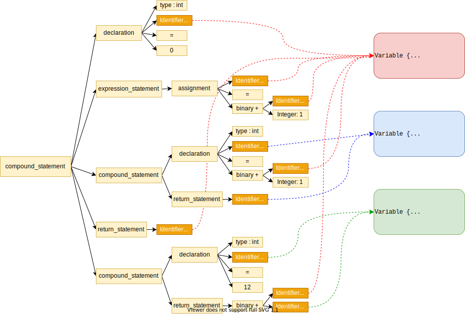

# step7 实验指导

## 词法语法分析
如果你使用工具完成词法语法分析，修改你的语法规范以满足要求，自行修改词法规范，剩下的交给工具即可。

至于变量相关的语义检查，因为它们和名称解析密切相关，所以可以放到那里面去，参见后文。

手写分析只需根据产生式变化增量变化即可，如果你将名称解析在语法解析中完成，你可能需要按照本章指导调整你的这部分代码，一点[提示](./manual-parser.md)。

## 名称解析
step7 我们需要给自己的编译器新增一个阶段：名称解析，它位于语法分析和 IR 生成之间。
> 这个词广义上的含义就是：把名称关联到对应的实体。例如网络原理中的 DNS 也是名称解析。
>
> 并且，我们所谓 “阶段” 也只是逻辑上的。就 MiniDecaf 的实现而言，名称解析的代码也可以嵌入 IR 生成里。

名称解析的阶段任务就是把 **AST 中出现的每个变量名关联到对应的变量**，它需要遍历 AST，所以实现为 AST 上的一个 Visitor
* *它的输入* 是 parser 给的 AST
* *它的输出* 是上面那棵 AST，但 AST 中所有涉及变量名的结点都增加一个属性，表示此处的变量名到底标识哪个变量
> 这样的结点有：`primary`、`assignment` 和 `declaration`。
>
> 代码中，这样的属性可以实现为指向 [变量数据结构](../lab5/stackframe.md#变量声明) 的一个指针。
> 也可以实现为一个从 AST 结点到变量的映射。

下面是一个例子：
> 考虑我们有一段代码：
> ```
> {
>     int a=0;
>     a=
>         a+1;
>     if (a) {
>         int a=2;
>         return a;
>     }
>     return a;
>     {
>         int b=12;
>         return a
>                 +b;
>     }
> }
> ```
> 显然其中有三个变量，两个的名字是 `a` 一个的是 `b`。不妨把这三个变量记为 `a0`, `a1`, `b0`。
> 名称解析应当发现这点，并且还要把每个变量名关联到变量，所以它提供的信息类似：
> ```
> {
>     int a=0;            // a0
>     a=                  // a0
>         a+1;            // a0
>     if (a) {            // a0
>         int a=2;        // a1
>         return a;       // a1
>     }
>     return a;           // a0
>     {
>         int b=12;       // b0
>         return a        // a0
>                 +b;     // b0
>     }
> }
> ```
> 如果按照定义把这个结果画在语法树上，那么大致如（仅示意，省略了一些不重要的中间结点）
> 

用于储存变量信息的 **符号表** 的结构也需要改进，以支持作用域。具体的，它需要支持
1. 符号表中，区分不同作用域的变量：支持声明覆盖（shadowing)、检查重复声明
2. 离开某作用域时，要把其中的变量从符号表中删除

为此，我们把符号表改造为一个栈。
1. (对应上面 1.）栈中每个元素都对应一个开作用域，是一个列表，包含该作用域中至今声明过的所有变量。
    > 程序中不同位置的符号表是不同的；某位置的 **开作用域（open scope）** 指的是包含该位置的所有作用域。
    > 例如上图中 `return a+b;` 处，有两个开作用域（声明 a0 和 b0 的），而声明 a1 的作用域不是开作用域。
2. （对应上面 2.) 每进入一个作用域，就压栈一个空列表；离开作用域就弹栈
3. 在符号表中查找变量名，从栈顶往下查找（所以内层声明才能覆盖外层声明）。

另外， **变量偏移量** 的确定方法也需要修改。
如果我们还假设偏移量是 `-12-4*frameaddr`，那变量的 frameaddr 就不单纯是第几个变量了。
为了保证 step5 中叙述的栈帧性质，其 frameaddr 是 “在此变量刚声明之前，所有开作用域中的变量总数”。
例如上图中，`frameaddr(a1) == frameaddr(b0) == frameaddr(a0)+1`。

最后，名称解析 Visitor 需要
1. 维护符号表，进入块语句（`compound_statement`）时压栈、离开时弹栈
2. 每次遇到变量名（`Identifier`）时查找符号表，将其关联到具体的变量，或者报错变量未声明
3. 每次遇到声明（`declaration`），确定 `frameaddr`、建立变量并插入符号表，或者报错变量重复声明


## IR 生成
无须新增 IR 语句。

块语句的 IR 由其中子语句 IR 顺序拼接而成即可。

## 汇编生成
无须修改。

# 任务
1. 改进你的编译器，支持本节引入的新特性，通过相关测试。
2. 实验报告中回答思考题。

# 总结
本节最重要的内容是名称解析。
