# Python-ANTLR
这个文档用来介绍 Python-ANTLR，以及解释它的实现和指导书的不同。

# 概述
Python-ANTLR 参考实现使用 python 语言（python >= 3.6），使用 [ANTLR](https://www.antlr.org/) 工具进行词法语法分析。
> 网页版使用 brython 动态翻译 python 到 javascript 执行。

如果你要看 Python-ANTLR，至少你要会 python 3，要会写 python 的 `class`，看得懂 `[a+1 for a in l]` 等等。

Python-ANTLR 的特点，以及一些注意事项是
* 用 **ANTLR** 做语法词法分析，所以词法语法分析很简单。
* **真·多遍**，词法语法分析、名称解析（step7）、类型检查（step12）、IR 生成、汇编生成几个过程都是独立的。
* 前面的几个 step 是 64 位的，在 commit: 49aecac 中修正，
  并且前面 step 也有 bug 到后面才被修正。
    > 因此代码 **仅供参考** ，如果你直接切到前面的 commit 是不能通过测试的。
* 每个 step 都是一个或多个 commit，可以一个一个 commit 来看每个步骤到底改了什么

commit 大致分为几类，根据 commit message 分为：

| commit message | 这个 commit 做了啥 |
| --- | --- |
| `BUGFIX ...` / `fix ...` | 修正以前实现的 bug |
| `step *. s* ....` | 完成某 step（后面 s1..s6 是六个大步骤，step 是小步骤） |
| `... refactor ...` | 代码重构 |

# 实验框架
Python-ANTLR 大致思路和实验指导书相同，但有一些小区别。

## 代码结构
下面是 12 个 step 完全做完以后 minidecaf 中，各个主要文件和目录的作用。

```
minidecaf
├── __init__.py
├── __main__.py
├── main.py                     main。顶层逻辑，minidecaf 从这里开始执行
├── utils.py
│
├── asm                         编译器后端：IR 到汇编
│   ├── command.py                  汇编中可能出现哪几种元素
│   ├── __init__.py                 后端通用框架
│   └── riscv.py                    RISC-V 对于通用框架的实现
│
├── frontend                    编译器前端：词法语法分析、名称解析、类型检查
│   ├── __init__.py                 把 namer/irgen/typer 几个阶段包装一下给 main 用
│   ├── irgen.py                    IR 生成阶段
│   ├── namer.py                    名称解析阶段
│   ├── typer.py                    类型检查阶段
│   └── types.py                    类型定义和类型规则（给 typer 用的）
│
├── generated                   ANTLR 生成的代码放在这里面
│   └── __init__.py
│
├── ir                          IR 的定义
│   ├── __init__.py                 定义 IR 的函数/全局变量/程序
│   ├── instr.py                    各 IR 指令
│   └── visitor.py                  后端实现为一个 IR visitor
│
├── CommonLex.g4                词法定义，就是 ../specs/CommonLex.g4
├── MiniDecaf.g4                语法定义，就是 ../specs/s6.g4
└── requirements.txt            minidecaf 作为 python 包的依赖
```

## IR 的区别
我们的 IR 和指导书一样，但有些名字有些不同

| Step | 指导书的 IR | Python-ANTLR | 备注 |
| --- | --- | --- | --- |
| 1 | push | Const | |
| 1 | ret | Ret | |
| 2 | neg, not, lnot | Unary | |
| 3,4 | add, sub, mul, div, rem, eq, ne, lt, le, gt, ge, land, lor | Binary | |
| / | 实验指导书中没有 | Comment | |
| 5 | pop | Pop | |
| 5 | load | Load | |
| 5 | store | Store | |
| 5 | frameaddr | FrameSlot | 设参数是 `k`，则 `frameslot k` 最终在 `k(fp)`，而 `frameaddr k` 在 `-12-4*k(fp)` |
| 6 | label | Label | |
| 6 | br, beqz, bnez | Branch | |
| 9 | globaladdr | GlobalSymbol | |
| 9 | call | Call | |

并且栈帧也略有不同，fp 的位置有变化。
所以局部变量的位置不是 `-12(fp)`、`-16(fp)` 而是 `-4(fp)`、`-8(fp)` 以此类推。



## step5
不是计算 `FRAMESIZE` 然后在 prologue 直接 `addi sp, sp, -FRAMESIZE`，而是每次遇到声明再分配 4 个字节空间，离开声明所在作用域时在释放其空间（待 step7 引入作用域后）。

所以如下代码
```
int main() {
    int a=144;
    { int a=155; }
    return a;
}
```

会翻译为如下 IR：
```
        const 144               # 栈大小加 4、给 a 分配空间；正好 4 就放到 a 的内存里作为初值
        const 155               # 给第二个 a 分配空间和设置初值
        pop                     # 离开第二个 a 的作用域，释放第二个 a 所占的空间
        frameslot -4            # 这三条都是读取 a 的
        load
        ret
        pop                     # 离开第一个 a 的作用域、释放空间（上面有 ret，所以这个 pop 永远不会被执行）
```

## step7
名称解析要求我们确定源代码中一个变量名到底是引用哪个变量。

对于每个函数，其名称解析结果放在它的 `FuncNameInfo` 中，作为一个 dict `_v`。
* 变量名用它的 AST 节点表示，例如 `ctx.Ident()`，其中 `ctx` 可能是 `AtomIdentContext`、`DeclContext` 等。
* 变量用 `Variable` 表示，`Variable.ident` 是变量名，`Variable.id` 是一个计数器用来区分同名变量。

然后把各个函数的 `FuncNameInfo` 一起放到 `NameInfo` 里。

## step9
参数处理不使用指导书上说的办法：
prologue 里面要把参数从 caller 的栈帧复制到 callee 的栈帧，然后当成普通 `decl` 处理。

调用约定就是指导书上说的非标准的调用约定（参数从右往左压栈）。

## step12
左值分析放到 typer 里面做了，在 `class Locator` 里面。
它计算左值的地址，然后返回值是一个列表，包含 IR 指令和 AST 结点。
例如 `int a[6];` 那么 `a[2+3]` 的左值地址就是
`[ a 的 AST 结点, 2+3 的 AST 结点, const 4, mul, add ]`。

类型规则用一个函数表示，参数是操作数类型，函数要加 `@TypeRule` 修饰。
如果操作数类型满足规则的要求，那么返回结果类型，否则返回一个字符串表示报错消息。

typer 遍历 AST 时记录表达式类型（方法类似[Visitor 文档最后一部分](../lab1/visitor.md)），类型保存到 `TypeInfo` 里。
注意 `FuncTypeInfo` 只函数本身的参数类型/个数和返回值类型，它和 `TypeInfo` 的关系与 `FuncNameInfo` 和 `NameInfo` 的关系不同。

