# TypeScript-ANTLR

* 地址 https://github.com/equation314/minidecaf
* 演示网址：https://equation314.github.io/minidecaf

## 概述

本参考实现基于 [TypeScript](https://www.typescriptlang.org/) 语言，使用 [ANTLR](https://www.antlr.org/) 工具进行语法分析。可以直接转换为 JavaScript，原生支持在浏览器上运行。

本参考实现具有以下特点：

* **基于 ANTLR 的词法语法分析**。使用了 ANTLR 工具进行词法和语法分析，详见 [ANTLR 使用](../lab1/antlr.md)。
* **网页版编译器**。通过将 TypeScript 翻译到 JavaScript，可直接在浏览器中运行 MiniDecaf 编译器，生成 RISC-V 汇编。
* **在浏览器上运行源程序**。本参考代码基于对生成的中间表示的模拟执行，实现了一个解释器，能够在网页上直接运行源程序，并得到执行结果（`main` 函数返回值），无需再用 QEMU 等模拟器运行。

此外，与其他参考代码一样，本参考代码完成每个 step 的过程，都被分成了一个或多个 [git commit](https://github.com/equation314/minidecaf/commits/master)，你可以使用 `git diff` 得到相邻两次 commit 的差异，来明确每一步需要完成哪些工作。每一个 step 的最后一个 commit 都被打上了 [tag](https://github.com/equation314/minidecaf/tags)，并都能通过部署在 Github Actions 上的[自动测试](https://github.com/equation314/minidecaf/actions?query=workflow%3A%22Build+%26+Test%22)。

**特别注意：实现网页版编译器和解释器不是本实验的必做内容。**

### TypeScript 是什么？

TypeScript 是 JavaScript 的超集（类似于 C++ 是 C 的超集），顾名思义就是加了类型的 JavaScript。除了类型系统外，还增加了接口、枚举、泛型等众多新特性，比 JavaScript 更加面向对象，更加容易编写，更能发现潜在的错误，更适合开发大型应用。

TypeScript 可以被直接翻译到 JavaScript，因此不仅能使用 [Node.js](https://nodejs.org/en/) 在命令行里运行，还支持在浏览器里运行。本参考代码就是通过这种方式，先用更加友好的 TypeScript 进行开发，再转成 JavaScript，实现了能在浏览器里运行的编译器。

> 由于 TypeScript 对 JavaScript 的兼容性，你也可以直接用 JavaScript 语言进行开发。

### 要不要选择用 TypeScript 写编译器？

如果你已经会了 TypeScript 语言，或对 Web 开发感兴趣，或想要一个自己亲手制作的炫酷的网页版编译器，强烈建议使用 TypeScript 语言进行实验。如果你只是会 JavaScript，那么上手 TypeScript 是很容易的，当然你也可以直接用 JavaScript 进行开发。如果两者都不熟悉也没关系，作为脚本语言，它们都非常简单易学。

关于 TypeScript 的入门教程与文档，详见：

* 官方入门教程：https://www.typescriptlang.org/docs/handbook/typescript-tooling-in-5-minutes.html
* 官方手册：https://www.typescriptlang.org/docs/handbook/intro.html
* 中文版教程与手册：https://www.tslang.cn/docs/home.html

## 环境配置

下面给出了此版本参考代码的环境配置、构建与运行、以及测试的方法。

### 安装 Node.js

去[官网](https://nodejs.org/en/download/)下载并安装 Node.js（同时包含了包管理器 npm），建议使用 12 以上的版本。

### 安装依赖

进入参考代码目录，先运行以下命令一键安装依赖：

```bash
npm install
```

运行完后当前目录中会多出一个 `node_modules` 文件夹，里边包含了开发所需的各种所需的软件包和运行库，例如 TypeScript 编译器 `tsc`、ANTLR 工具等等。

> 你无需再像[step1：词法语法分析工具](../lab1/part2.md)那里一样下载 ANTLR 的 JAR 包。

### 命令行运行

```bash
npm run grammar                 # 生成 ANTLR 语法分析器
npm run build                   # 将 TypeScript 编译成 JavaScript
npm run cli test/test.c -- -s   # 使用 node 运行生成的 JS 代码，编译 test/test.c 并生成汇编码
```

即可看到对[测试文件](https://github.com/equation314/minidecaf/blob/master/test/test.c)编译后生成的 RISC-V 汇编码。上面第三条命令后面的是编译选项，`-s` 表示生成汇编码，不加 `-s` 就会直接运行并输出 `main` 函数的返回值。运行 `npm run cli -- -h` 查看更多编译选项。

### 测试

测试单个文件（即 [test/test.c](https://github.com/equation314/minidecaf/blob/master/test/test.c)），得到它的运行结果（`main` 函数返回值）：

```bash
npm run test                    # 作为解释器运行
# 或 `npm run test-codegen`，会先生成 RISC-V 汇编码，再在模拟器(QEMU 或 Spike)中运行。
```

运行我们提供的所有[测例](https://github.com/decaf-lang/minidecaf-tests)：

```bash
npm run test-all -- -n 12       # 作为解释器运行
# 或 `npm run test-all -- -s -n 12`，会先生成 RISC-V 汇编码，再在模拟器(QEMU 或 Spike)中运行。
```

这里 `-n <N>` 表示只运行 step1 到 stepN 的测例。

> 请确保你在 clone 仓库时加了 `--recursive` 选项，将[测例仓库](https://github.com/decaf-lang/minidecaf-tests)也一起 clone 了下来。
>
> 如果加了 `-s` 选项，会自动调用 [minidecaf-tests/check.sh](https://github.com/decaf-lang/minidecaf-tests/blob/master/check.sh) 运行测试。但该脚本不支持测试解释器，只好写在 [test/test_all.sh](https://github.com/equation314/minidecaf/blob/master/test/test_all.sh) 中。

### 【可选】网页版编译器

```bash
npm run build-web               # 将 TS 编译成 JS，然后将所有 JS 文件打包以便在网页上调用
npm run serve                   # 启动简易的 HTTP 静态服务器
```

在浏览器中打开网址 http://127.0.0.1:8080 即可看到，效果与 https://equation314.github.io/minidecaf 一样。在左上角输入 MiniDecaf 源代码，点击“Run”即可编译，左下角会得到运行结果，右上角和右下角分别是生成的中间表示与 RISC-V 汇编码。

## 实验框架

如果你打算使用 TypeScript/JavaScript 语言完成本实验，实现网页版编译器，我们提供了一个[实验框架](https://github.com/equation314/minidecaf/tree/skeleton)。该框架已经帮你完成了 TypeScript 项目配置、网页前端开发、自动测试和部署等与实验无关的内容，你只需集中精力完成实验部分，填入你自己的编译器的实现，即可得到一个你自己的网页版编译器。

### 快速入门

在 clone 整个仓库后，切换到 `skeleton` 分支，即可开始实验。

```bash
git clone https://github.com/equation314/minidecaf.git --recursive
git checkout skeleton
```

实验框架已经进行了基本的项目配置，你可直接运行与上一节“环境配置”中类似的命令：

```bash
npm install                     # 安装依赖
npm run build                   # 将 TS 转 JS
npm run cli test/test.c -- -s   # 运行 JS 代码，生成汇编

# 测试
npm run test-codegen            # 对 test/test.c 生成汇编，并在模拟器中运行
npm run test-all -- -s [-n <N>] # 运行 step1 到 step<N> 的全部测例

#【可选】构建网站
npm run build-web               # 将 TS 编译成 JS 并打包
npm run serve                   # 启动简易的 HTTP 静态服务器
```

> 框架中没有实现 `npm run grammar` 命令，这与你的语法分析器的实现方式有关。如果你也使用一些工具进行语法分析器的生成，可以在 [package.json](https://github.com/equation314/minidecaf/blob/skeleton/package.json) 中添加类似的命令。例如要安装和使用 TypeScript 版的 ANTLR，详见参考代码或 https://github.com/tunnelvisionlabs/antlr4ts 。

运行完后，只会输出一行 `nop`。这是因为[框架中的编译函数](https://github.com/equation314/minidecaf/blob/skeleton/src/minidecaf.ts)就是这么写的：

```ts
export function compile(input: string, option: CompilerOption): string {
    if (option.target === CompilerTarget.Riscv32Asm) {
        return "nop";
    } else if (option.target === CompilerTarget.Executed) {
        return "0";
    }
}
```

> 本实验无需实现解释器，你只需要处理 `option.target === CompilerTarget.Riscv32Asm` 的情况即可。

本函数就是你在实验中需要完成的部分。在每一个 step 中，你都需要让该函数返回正确的 RISC-V 汇编。你可以随意增加文件，不过不建议对除 [src/minidecaf.ts](https://github.com/equation314/minidecaf/blob/skeleton/src/minidecaf.ts) 以外的文件做修改。

为了让部署在 git.tsinghua.edu.cn 中的 CI 能自动测试你的代码，**请确保对给定源文件生成汇编的命令为以下格式**：

```bash
npm run cli -- <c_file> -s -o <asm_file>
```

如果你不使用我们提供的框架，请自行在 `package.json` 的 `scripts` 字段中添加 `cli` 字段，并填好运行你的 JS/TS 编译器的命令。此外你的编译器至少需要支持 `-s` 和 `-o` 选项。如果不想自己折腾建议直接使用我们的框架。

### 【可选】自动测试与部署

如果你使用 Github 进行代码托管，可使用 [Github Actions](https://docs.github.com/en/actions) 搭建 CI(continuous integration)，进行自动测试与网站的自动部署。我们已经提供了 [workflow 文件](https://github.com/equation314/minidecaf/tree/master/.github/workflows)，每次 push 任何分支都会使用 [test.yml](https://github.com/equation314/minidecaf/blob/master/.github/workflows/test.yml) 中的配置，自动构建并跑我们的测试用例；每次 push master 都会创建 GitHub Pages，部署网页版编译器。

[test.yml](https://github.com/equation314/minidecaf/blob/master/.github/workflows/test.yml) 中也包含了如何在一个干净的系统中配置实验环境的命令，如安装 RISC-V 工具链、安装 QEMU 等，可以作为配置环境时的参考。

## 与实验总指导的差异

本节列出了本参考实现与实验总指导的几处主要不同，能够帮你更好地理解这份参考代码。参考代码中也提供了详细的注释帮助你理解。你在做实验时应该主要关注实验总指导，无需和这里的实现一样。另外本节内容涉及多个 step 中的细节，建议根据你目前所做的 step 选择性查阅相关内容。

### 整体架构

参考代码中编译器的整体流程如下：



1. 源代码经过 ANTLR 词法和语法分析器，生成 ANTLR 分析树；
2. 使用 ANTLR visitor 模式对分析树进行名称解析、类型检查等语义检查，并在节点上标记一些属性；
3. 使用 ANTLR visitor 模式对分析树生成中间表示；
4. 将中间表示转换为 RISC-V 汇编，之后用 GCC 生成可执行文件，并在 QEMU/Spike 上运行；
5. 【可选】用解释器模拟中间代码的执行，直接得到结果。

以下是参考代码的目录结构：

```
src/
├── grammar/            # 语法
│   ├── Lexer.g4            # ANTLR 词法规则
│   └── MiniDecaf.g4        # ANTLR 语法规则
├── target/             # 编译目标
│   ├── executor.ts         # IR 解释执行器
│   └── riscv.ts            # IR 到 RISC-V 的代码生成
├── visitor/            # ANTLR visitors
│   ├── irgen.ts            # IR 生成器
│   └── semantic.ts         # 语义检查
├── cli.ts              # 命令行工具
├── error.ts            # 定义了各类错误
├── ir.ts               # 中间表示
├── minidecaf.ts        # 编译器主入口
├── scope.ts            # 作用域
└── type.ts             # 类型系统
```

### 语法树（所有 step）

本参考实现没有真正构建出抽象语法树，而是直接使用了 ANTLR 自动生成的分析树。

在第一次遍历分析树时（详见 [src/target/semantic.ts](https://github.com/equation314/minidecaf/blob/master/src/visitor/semantic.ts)），会给分析树增加一些额外的属性，以便之后的分析。使用 JavaScript 的语法可以方便地给任何 object 增加属性，例如：

```ts
visitType(ctx: MiniDecafParser.TypeContext): Result {
    if (ctx.Int()) {
        ctx["ty"] = BaseType.Int;
    } else {
        ctx["ty"] = new PointerType(ctx.type().accept(this)["ty"]);
    }
    return ctx;
}
```

其中属性 `ty` 表示节点的类型。其他重要的属性还有：

| 属性名 | 具有该属性的节点 | 含义 |
|-------|---------------|------|
| `ty`  | 表达式  | 类型 |
| `lvalue` | 表达式 | 是否是左值 |
| `paramCount` | 函数 |参数个数 |
| `localVarSize` | 函数 | 局部变量所占内存大小 |
| `variable` | 标识符 | 对应的变量（`Variable` 类） |
| `loop` | break、continue 语句 | 对应的循环语句节点 |

### 中间表示（所有 step）

为了方便直接在浏览器上执行源程序并得到结果，本参考代码也使用了中间表示，并实现了对中间代码的模拟执行。不过与 step1 中讲的 [IR 简明介绍](../lab1/ir.md)这一节有所不同，这里的 IR 不只是一个简单的栈结构，还包含了两个寄存器。

> 如果你不打算实现解释器，可不使用中间代码，直接从 AST 生成汇编。

在 [IR 简明介绍](../lab1/ir.md)和之后的 step2、step3 中，我们介绍了如何使用基于栈的 IR 来表示一元和二元运算。例如，要计算表达式 `1 + (-2)`，IR 如下：

```python
PUSH 1      # 把 1 压入栈顶
PUSH 2      # 把 2 压入栈顶
NEG         # 从栈顶弹出一个元素，对其取相反数，再压入栈顶
ADD         # 从栈顶弹出两个元素，计算它们的和，再压入栈顶
```

直接转换成 RISC-V 汇编码，将会是：

```asm
# PUSH 1
addi sp, sp, -4
li t1, 1
sw t1, 0(sp)
# PUSH 2
addi sp, sp, -4
li t1, 2
sw t1, 0(sp)
# NEG
lw t1 0(sp)
neg t1, t1
sw t1, 0(sp)
# ADD
lw t1, 4(sp)
lw t2, 0(sp)
add t1, t1, t2
addi sp, sp, 4
sw t1, 0(sp)
```

可以发现，这种 IR 的一个缺点是压栈、弹栈操作太多。最终生成的汇编代码有 16 条指令，其中真正用于计算的指令才 2 条（`neg` 和 `add`），而剩下的 14 条都是与计算结果无关的栈操作，运行效率可想而知。

本参考实现中对以上 IR 做了一个简单优化，即引入了两个寄存器 `r0` 和 `r1`，上一步的计算结果默认存在 `r0` 中而不是栈顶。这样尽可能使用寄存器而不是栈来保存中间结果，使得 IR 更加接近于机器代码，执行效率更高。例如，使用该 IR 计算表达式 `1 + (-2)` 如下：

```python
IMM 1, r0   # r0 = 1
PUSH r0     # 把 r0 压入栈顶
IMM 2, r0   # r0 = 2
NEG r0      # r0 = -r0
POP r1      # 从栈顶弹出一个元素，存到 r1
ADD r1, r0  # r0 = r1 + r0
```

转换成 RISC-V 汇编码如下：

```asm
# IMM 1, r0
li t0, 1
# PUSH r0
addi sp, sp, -4
sw t0, 0(sp)
# IMM 2, r0
li t0, 2
# NEG r0
neg t0, t0
# POP r1
lw t1, 0(sp)
addi sp, sp, 4
# ADD r1, r0
addi t0, t1, t0
```

共 8 条指令，比之前的减少了一半。

此外，本参考实现中的 IR 指令不隐式包含栈操作，只有 `PUSH`、`POP` 指令可以进行压栈、弹栈（还有 `CALL` 指令在函数调用结束后会从栈中弹出参数个数个元素），而不像之前的 IR 中，执行一条二元运算指令也意味着栈中要减少一个元素，

完整 IR 的指令表详见 [src/ir.ts](https://github.com/equation314/minidecaf/blob/master/src/ir.ts)。

### 调用约定（step9）

本参考实现遵循了 step9 中描述的 [GCC 的调用约定](../lab9/calling.md)：

> 1. caller-save 和 callee-save 寄存器在 ["Unprivileged Spec"](../lab0/riscv.md) 的 109 页。
> 2. 返回值（32 位 int）放在 `a0` 寄存器中。
> 3. 参数（32 位 int）从左到右放在 `a0`、`a1`……`a7` 中。如果还有，则从右往左压栈，第 9 个参数在栈顶。

具体地，在 commit [6965523](https://github.com/equation314/minidecaf/commit/69655239e25c901f4b6c10429239ed3f982c303a) 及之前使用的是 step9 中描述的简化版调用约定，在 commit [fd5bccc](https://github.com/equation314/minidecaf/commit/fd5bcccb741258bc0ab746a3034a6aea0acdc973) 更改为了 GCC 的调用约定。如果你也想使用 GCC 的调用约定，可以参考 commit fd5bccc 中的实现过程，否则参考 commit 6965523 即可。

实现过程也非常简单粗暴，效率上反而还不如简化版的，只是为了能够调用 GCC 编译的函数。具体做法为：当所有参数从右往左压栈后，从栈中弹出至多 8 个参数，分别存到 `a0`、`a1`……`a7` 中；由于参数寄存器属于临时寄存器，会在嵌套函数调用中被破坏，需要被保存，就在 callee 的 prologue 阶段再将它们保存到 callee 的栈帧上。

> 参数寄存器和局部变量如何在栈帧中布局不是调用约定的内容，可以自己任意定义，不需要遵循 GCC 的。

为了方便理解，下图给出了本参考实现中的栈帧布局：



### 【可选】解释器（所有 step）

本小节内容是可选的，如果想实现在浏览器中运行源程序，可阅读本小节以供参考。

本参考代码实现了对中间代码的模拟执行（详见 [src/target/executor.ts](https://github.com/equation314/minidecaf/blob/master/src/target/executor.ts)）。与 IR 的定义一样，解释器实现了对 IR 栈和两个寄存器的模拟。不过为了实现全局变量，还需有另一块内存来放置全局变量。为了方便 step12 实现的取地址操作，参考代码中把这两块内存进行了合并，并使用一个地址 `STACK_OFFSET` 加以区分，该地址以下是栈空间，该地址以上是全局数据的空间。因此还需要有个 `sp` 寄存器来表示栈顶地址。

此外，与真实机器以字节为单位的内存不同，模拟的内存就是一个 JavaScript 的数组，其中的元素可以是任意类型，参考代码中使用它来存放数据、地址、函数名等各种东西。而内存地址还是与真实机器的一样 4 个字节对齐，因此在通过地址访问内存数组中的元素时，需要把地址除以 4。

参考代码中的 [`Ir` 类](https://github.com/equation314/minidecaf/blob/master/src/ir.ts#L156)由一堆 `IrFunc` 和 `IrGlobalData` 组成，分别表示一个函数与一个全局变量。而一个 `IrFunc` 又由一堆 `IrInstr` 组成，即 IR 的指令。在模拟 IR 执行的过程中，有两个全局的数据 `currentFunc` 和 `pc`，分别表示当前所在的 `IrFunc` 和当前所处理的是其中的哪一条 IR 指令。一般情况下，每遇到一条指令，就会让 `pc` 加 1；如果是跳转指令，就让 `pc` 设为要跳转的标签的位置；如果是 `CALL` 指令，就更新 `currentFunc` 为被调用者，更新 `pc` 为 0。

对于函数调用，需要模拟出栈帧的结构，因此需要有一个栈帧寄存器 `fp`，之后对局部变量或参数的引用都是基于 `fp` 的。和生成目标代码一样，一条 IR 指令可能需要完成多步操作。例如 `CALL` 指令需要向栈中压入旧的 `currentFunc`、`pc` 和 `fp`，并更新它们；`RET` 指令需要从栈中恢复它们。对于传参，不需要考虑用寄存器传参，都用栈存放参数即可。
