# 函数调用
函数调用是最复杂的一种表达式结构了。
源代码里的一个函数调用，其实包含了下面几个步骤
1. 准备参数，完成传参
2. （汇编）保存 caller-save 寄存器
3. 真正执行 `call` 指令（汇编上是 `jalr` 指令）
> 执行 `call` 然后是子函数执行的时间, 直到子函数 `ret`（汇编上是 `jr ra`）返回
4. （汇编）恢复 caller-save 寄存器
5. 拿到返回值，作为函数调用这个表达式的值

> 这几步操作有时又被称为调用序列（calling sequence）

上面几步都需要我们确定 **调用约定（calling convention）**：
1. （第 1.、5. 步）参数和返回值都如何准备、该放哪儿？
2. （第 2.、4. 步）哪些寄存器是 caller-save 的？
3. （在 prologue/epilogue 中）那些寄存器是 callee-save 的？

调用约定通常是在汇编层级用到的，汇编语言课上也讲过。
因为汇编语言很底层，没有函数/参数的语言支持，只有标号/地址/寄存器，所以需要规定如何用汇编的语言机制模拟函数调用。
我们为了简单，IR 不提供对函数的语言支持，所以我们同样需要有 IR 的调用约定。

需要注意的是，调用约定只是一种约定，它不唯一。
> x86 上常见的就有默认的 cdecl（汇编课讲过）、stdcall、fastcall 等好几种。

只要 caller 和 callee 的调用约定相同，那么函数调用就不会出问题。

## RISC-V 的调用约定
32 位 RISC-V 的标准（指 gcc 使用的）的调用约定中，和我们相关的是：
1. caller-save 和 callee-save 寄存器在 ["Unprivileged Spec"](../lab0/riscv.md) 的 109 页。
2. 返回值（32 位 int）放在 `a0` 寄存器中
3. 参数（32 位 int）从左到右放在 `a0`、`a1`……`a7` 中。如果还有，则从右往左压栈，第 9 个参数在栈顶。

> 自己使用 gcc 编译一个有很多参数的函数调用即可验证。

为了简便和方便描述，我们下面使用一种非标准的调用约定。
1. callee 只需要保存 `fp` 和 `ra`，caller 无须保存寄存器
2. callee 把返回值放在 `a0` 中，caller 看到返回之后把返回值压入运算栈
3. 参数不用寄存器传递，所有参数从右往左压栈，第 1 个参数在栈顶。

> 这个调用约定的优点是叙述和实现简单，但不标准。
> 你当然可以选择实现标准的调用约定，这样你的汇编能够和 gcc 的汇编互相调用，但是难度会大一些。
> 
> 助教的实现用的也不一定是这个调用约定。

采用这个非标准的调用约定，仿照 step5 我们可以画出函数调用过程中栈帧的变化图。
可见现在栈帧包含四块，从顶向下依次是运算栈、实参、局部变量、`fp` 和 `ra`（下图 1.）。

其中还有一个问题就是形参的处理，例如上面 3. 到 4. 过程中，`bar` 要访问 `a`，那 `a` 放在哪儿？
可以直接使用 `foo` 栈帧上的实参，那么 `a` 相对 `fp` 的偏移量为 0，同理 `b` 偏移量为 4。
因此 step7 中的偏移量计算方法仅限非参数的局部变量，而第 `k>=0` 个参数相对于 `fp` 的偏移量是 `4*k`。

> 还有一种方法是把参数当成普通局部变量，在 prologue 中复制到栈帧中局部变量的区域。

## IR 的调用约定
对于 IR 类似上面简便的约定：
1. 传参从右到左压栈
2. 返回值放在栈顶

另外，IR 也需要保存返回地址，如果它要作为一门独立的语言，需要被执行的话。
但我们暂时没有这个需求，可以不管它。可以假设 call 指令会把返回地址保存到其他地方，并且同时把当前栈帧设为新函数的。
> 汇编的 `call`（就是 `jalr`）会保存返回地址到 `ra`，然后 prologue 里会保存 `ra` 到 callee 栈帧中。
