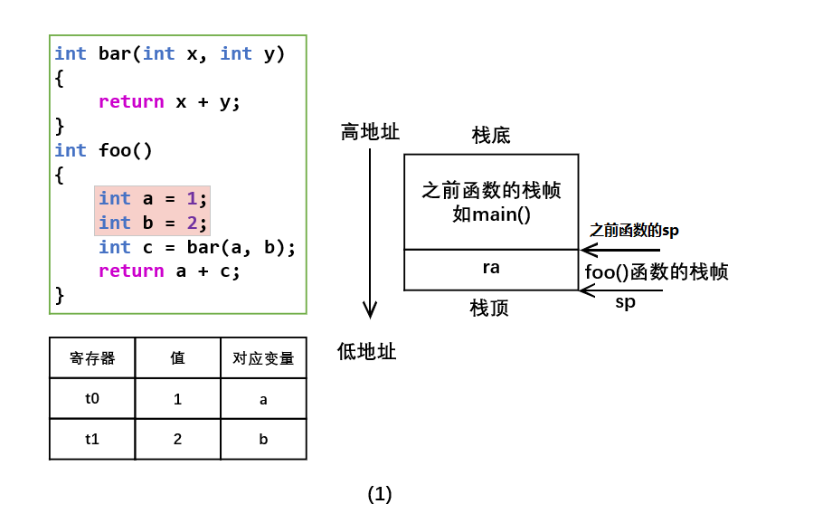
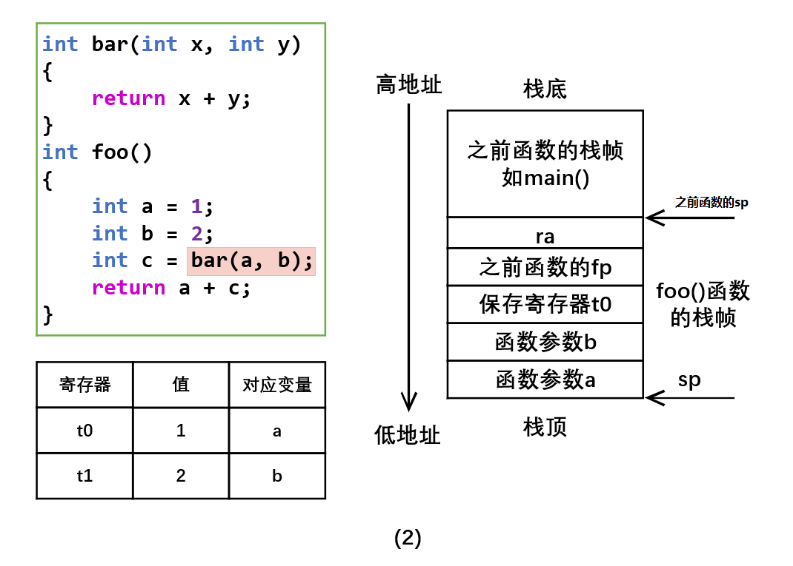
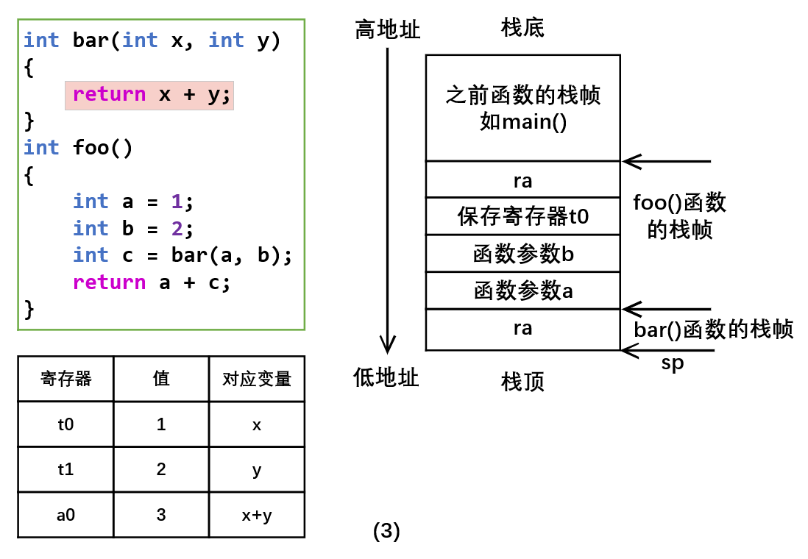
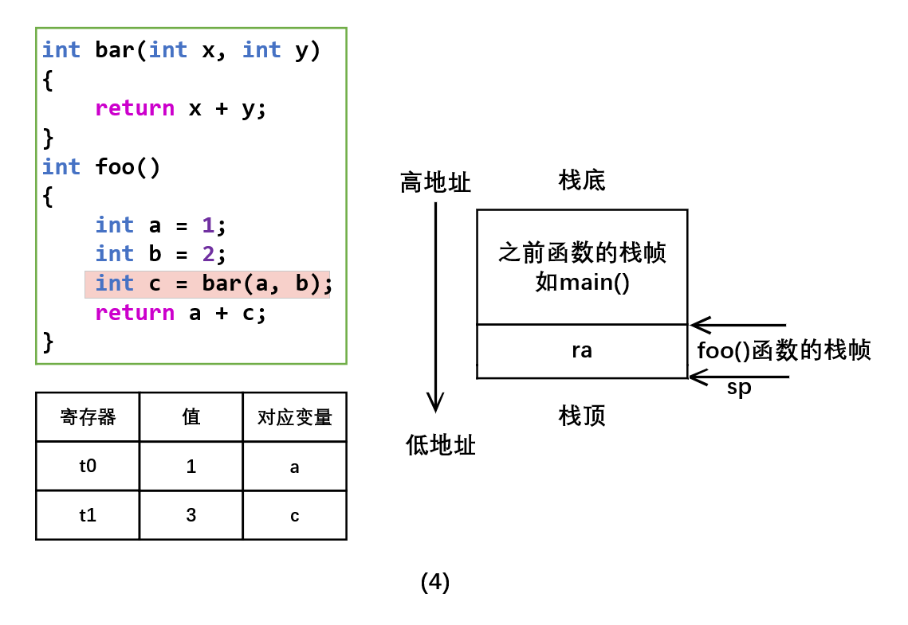
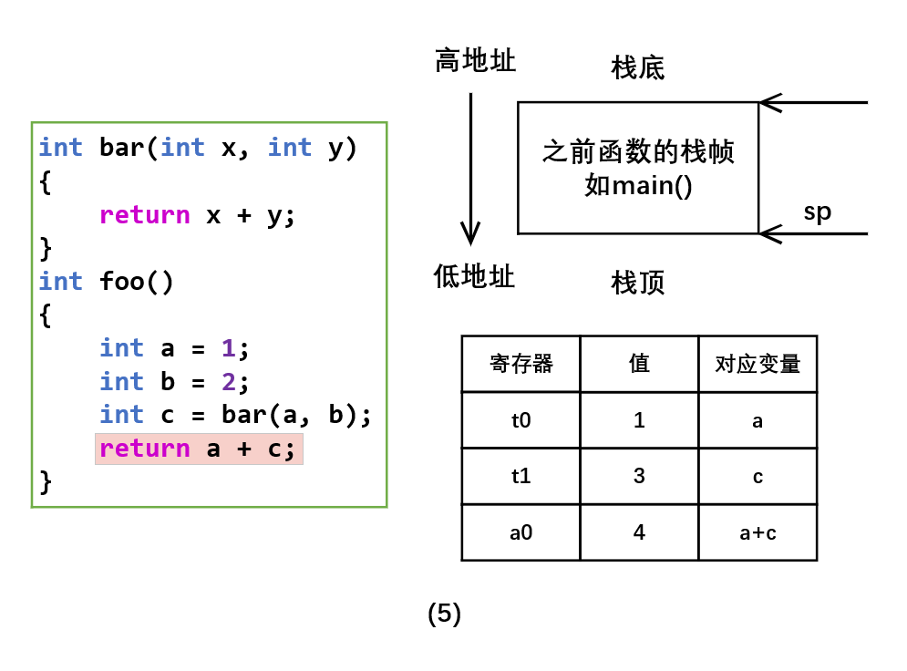

# step9 实验指导

本实验指导使用的例子为：

```C
int func(int x, int y) { return x + y; }
int main() { return func(1, 2); }
```

## 词法语法分析

针对函数特性，我们需要设计 AST 节点来表示它，给出的参考定义如下：

| 节点 | 成员 | 含义 |
| --- | --- | --- |
| `Function` | 返回类型 `return_type`，函数名 `ident`，参数列表 `params`，函数体 `body` | 函数 |
| `Parameter` | 参数类型 `var_type`，变量名 `ident` | 函数参数 |

## 语义分析

本步骤中引入了函数，和局部变量类似，不允许调用未定义的函数，也不允许重复定义同名函数。因此，需要在全局作用域的符号表里维护函数符号。函数符号存放在栈底的全局作用域中，在遍历 AST 构建符号表的过程中，栈底符号表一直存在，不会被弹出。

此外，由于函数体内部除了局部变量以外，还有**函数参数**（argument）。因此，我们进入一个函数，开启函数体局部作用域时，需要将所有的参数加进该作用域的符号表中。举例来说，如果我们将示例改成：

```C
int func(int x, int y) { int x = 1; return x + y; }
```

那么语义检查时应当报错。

### Python 框架

`frontend/symbol/funcsymbol.py` 里实现了函数符号。

### C++ 框架

`symb/symbol.hpp` 中 Function 类表示函数符号。`scope/scope.hpp` 中，FuncScope 表示函数作用域。

## 中间代码生成

为了实现函数，我们需要设计两条中间代码指令，分别表示设置参数和函数，给出的参考定义如下：

| 指令 | 参数 | 含义 |
| --- | --- | --- |
| `PARAM` | `T0` | 将 T0 设置为下一个参数 |
| `CALL` | `LABEL` | 调用函数 LABEL |

假设我们有若干个参数，可以依次使用 PARAM 命令将它们加入参数列表。在调用函数时，这些参数的值会自动依次按顺序装载到临时变量 _T0, _T1 ... 中。比如我们有这样一段 TAC 程序：

```assembly
PARAM A
PARAM B
PARAM C
XX = CALL XXX
```

那么，在进入 XXX 函数时，相当于执行了：

```assembly
_T0 = A
_T1 = B
_T2 = C
```

因此，示例可以对应如下的 TAC 程序：

```assembly
func:
	_T2 = ADD _T0, _T1
    return _T2        # 参数 x 和 y 分别对应 _T0, _T1
main:
    _T0 = 1
    PARAM _T0         # 将 _T0 的值作为参数 x
    _T1 = 2
    PARAM _T1         # 将 _T1 的值作为参数 y
    _T3 = CALL func   # 调用函数
    return _T3
```

同学们可以使用这种参考的实现形式，也可以自行思考传参的处理方法。

## 目标代码生成

接下来详细介绍函数调用的步骤和约定，以及函数调用及返回过程中栈帧的变化。

### 函数调用

程序代码里的一个函数调用，包含了下面一系列的操作：

1. 准备参数，完成传参。
2. （汇编）保存 caller-saved 寄存器。
3. 执行汇编中的函数调用指令，开始执行子函数直至其返回。
4. （汇编）回复 caller-saved 寄存器。
5. 拿到函数调用的返回值，作为函数调用表达式的值。

上述步骤 1-5 称为调用序列（calling sequence）。然而，调用序列中有一些问题需要解决：如何进行参数传递？如何获取函数返回值？调用者（caller）和被调用者（callee）需要保存哪些寄存器，如何保存？调用者和被调用者通常对以上问题约定解决方式，并同时遵守这些约定。这些调用者与被调用者共同遵守的约定称为**调用约定**（calling convention）。调用约定通常在汇编层级使用，汇编语言课上也有涉及。因为汇编语言是低级语言，缺乏对函数的语言特性支持，只有标号、地址、寄存器，所以需要调用约定，规定如何用汇编的语言机制模拟函数调用。

### 调用约定

如上所述，调用约定是 caller 和 callee 之间的一种约定。因此，调用约定并不唯一，只要 caller 和 callee 之间的调用约定相同，函数调用就可以顺利进行。在课程实验文档中，我们将给出两种参考的调用约定：一种是 gcc 使用的 32 位 RISC-V 标准调用约定，一种是简化之后的非标准调用约定。

> 需要说明的是，实验测例中没有与 gcc 编译的文件相互调用的要求，因此，大家实现简化版的调用约定即可。但是，如果对自己的编译器要求较高（比如，希望与用 gcc 编译所得的目标文件一起链接并进行相互的函数调用），那么就需要实现标准调用约定。

#### RISC-V 的标准调用约定（gcc 使用的、和 MiniDecaf 相关的）

1. caller-saved 和 callee-saved 寄存器

   

   上表给出 RISC-V 中 32 个整数寄存器的分类。所谓 caller-saved 寄存器（又名易失性寄存器），是指不需要在各个调用之间保存的寄存器，如果调用者认为在被调用函数执行结束后仍然需要用到这些寄存器中的值，则需要自行保存。所谓 callee-saved 寄存器（又名非易失性寄存器），指这些寄存器需要在各个调用之间保存，调用者可以期望在被调用函数执行结束后，这些寄存器仍保持原来的值。这要求被调用者，如果使用这些寄存器，需要先进行保存，并在调用返回之前恢复这些 callee-saved 寄存器的值。

   具体的保存方法并不限制，但一般都使用栈来保存。

2. 函数参数以及返回值的传递

   函数参数（32 位 int）从左到右存放在 a0 - a7 寄存器中，如果还有其他参数，则以从右向左的顺序压栈，第 9 个参数在栈顶位置。同学们可以使用编写一个带有多个参数的函数并进行调用，然后用 gcc 编译程序进行验证。

   返回值（32 位 int）放在 a0 寄存器中。

#### 简化版的非标准调用约定

1. caller-saved 和 callee-saved 寄存器

   callee 只需要保存 fp 和 ra 寄存器。其中 fp 寄存器中存储调用者栈帧的栈底地址，用于在函数调用结束之后恢复调用者的栈帧，ra 寄存器保存函数返回地址。程序实验框架中提供了数据流分析模块，caller 只需保存活跃变量对应的寄存器内容（数据流分析和活跃变量见 step8）。

2. 函数参数及返回值的传递

   不使用寄存器进行传参，所有参数从右往左压栈，第 1 个参数在栈顶。

   返回值（32 位 int）放在 a0 寄存器中。

### 函数调用过程中的栈帧变化（使用非标准调用约定）

为了帮助大家更好的理解，我们使用上述的**简化版的非标准调用约定**，画出了一段具有代表性的程序，其整个运行过程中栈帧的组成部分以及变化。代表性程序如下：

```C
int bar (int x, int y) {
    return x + y;
}
int foo () {
    int a = 1; 
    int b = 2;
    int c = foo(a, b);
    // return a+c 的目的是为了讲解保存活跃变量的情况
    return a + c;         
}
```



（1） foo 函数被调用，栈帧建立，变量 a 与 b 被分配对应寄存器。



（2）调用 bar 函数，由于变量 a 在函数调用结束之后还需要被使用（a+c），是活跃变量，需要保存到栈中。另外，按照调用约定对函数参数进行压栈传参。



（3）bar 函数内部进行运算，主要关注寄存器变化，栈帧方面仅仅是建立了 bar 函数的栈帧。



（4）bar 函数调用返回，其栈帧被销毁。



（5）foo 函数调用返回，其栈帧被销毁。

# 思考题

TODO
