## 代码生成

首先确定你要遵循的调用约定，你可以使用上一节中我们给出的简化版调用约定，也可以参考 GCC 的，也可以自己再定义一套。不过，你的编译器应该始终遵循同一套调用约定。本小节之后的描述都基于上一节的简化版调用约定。

### 函数序言

在 lab5 我们简单提及了函数的**序言**（prologue）与**收尾**（epilogue），这里我们将对这两部分代码的生成进行完善。

当一个函数开始执行前，需要做一些额外工作，即函数序言，这一部分的工作包括：

* 创建栈帧：根据局部变量和需要保存的寄存器的个数，栈帧的大小是可以事先确定的，直接令 `sp` 减去栈帧大小。在某些系统下，需要让栈指针 16 字节对齐，不过本实验中我们将其省略。
* 保存寄存器：在这一部分需要保存的寄存器即**被调用者保存**寄存器，在 RISC-V 中即以 `s` 开头的那些寄存器，不过在本实验中我们只用到了 `s0`（即 `fp`），所以不需要保存其他的。特别地，如果在该函数中调用了另一个函数，返回地址寄存器 `ra` 也会被修改，我们也将它保存在这里，但它其实是属于**调用者保存**寄存器。
* 设置栈帧指针：函数中用到的所有局部变量都是保存的栈帧中的，我们可以通过“栈帧基址寄存器”加“偏移”的形式来引用它们。不过我们不能直接使用 `sp` 作为栈帧基址寄存器，因为在后续栈式机的执行过程中栈可能会增长。这里我们用一个特殊寄存器 `fp`（等价于 `s0`）来保存栈帧基址，即**栈帧指针**（frame pointer），并将其设为原来的 `sp`。

生成的代码如下：

```asm
.globl func:                    # 设置标签 func 为全局可见
func:                           # 函数入口标签
    addi sp, sp, -framesize     # 创建栈帧
    sw ra, framesize-4(sp)      # 保存函数返回地址
    sw fp, framesize-8(sp)      # 保存上一函数栈帧指针
    addi fp, sp, framesize      # 设置新的栈帧指针
```

### 函数收尾

当一个函数运行结束，执行 `return` 语句后，还不能直接返回，还需要一些收尾工作，即函数收尾。这一部分的工作包括：

* 恢复寄存器：恢复那些在序言部分保存的寄存器，即返回地址 `ra` 和栈帧指针 `fp`。
* 销毁栈帧：令 `sp` 加上栈帧大小，保证 `sp` 在函数调用前后不变。
* 设置返回值并返回：将 `return` 语句中的返回值保存到 `a0` 寄存器，然后执行 `ret` 指令。

生成的代码如下：

```asm
func_epilogue:                  # 函数收尾部分标签
    lw ra, framesize-4(sp)      # 恢复函数返回地址到 ra
    lw fp, framesize-8(sp)      # 恢复上一函数栈帧指针到 fp
    addi sp, sp, framesize      # 销毁栈帧
    mv a0, retval               # 将返回值保存到 a0 寄存器
    ret                         # 等价于 jr ra
```

此外，在之前的 lab5 也提到过，对于所有的 `return` 语句，应该生成一条直接调转到函数收尾的语句，而不是直接一条 `ret` 指令。

### 函数调用

这里需要用到一条新指令 `call label`，其原型为 `jal ra, label`，表示“跳转到 `label`，并把返回地址保存到 `ra`”，而 `call` 只是一条伪指令。

当要调用一个函数时，不光是一条 `call` 指令就可以解决的，还需要考虑以下方面：

* 参数传递：根据我们的调用约定，使用栈从右往左进行传参。
* 寄存器的保存与恢复：我们需要在函数调用前保存**调用者保存**寄存器，并在调用结束后恢复。不过本实验使用栈式机模型，没有寄存器的分配，在栈式机执行过程中已经进行了寄存器的保存，因此无需专门保存调用者寄存器。

于是对于函数调用，我们可以生成以下汇编代码：

```asm
addi sp, sp, -arg_num*4     # 在栈上分配一块区域用于存放参数
sw arg_n-1, n*4-4(sp)       # 从右向左依次向栈中压入参数
...
sw arg_1, 4(sp)
sw arg_0, 0(sp)
call func                   # 调用函数 func，硬件会自动设置 ra 为下一条指令的地址
addi sp, sp, arg_num*4      # 回收栈空间

addi sp, sp, -4
sw a0, 0(sp)                # 将返回值压入栈，继续栈式机的执行
```

需要注意，在函数 `func` 中引用参数时，要能确定参数的位置，即算出正确的相对于 `fp` 的偏移。

### 栈空间布局

为了方便理解，这里给出了函数调用时的栈空间布局，以供参考：


