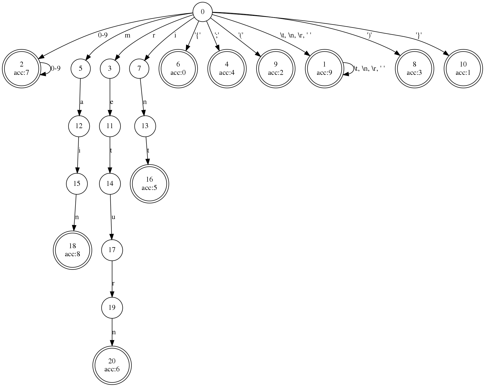

# 编写minidecaf编译器-step1

这是编写minidecaf编译器的第一个步骤的指导文档。

这里的minidecaf语言基本上是C语言的一个子集，而与之前的许多年中编译原理使用的decaf已经几乎没有任何关系。我们将编译器的设计拆分成许多个工作量适中的步骤，每个步骤的成果都是一个完整的编译器，区别在于相比于之前的步骤支持更多的语法。通过足够详尽的[测试程序](https://github.com/decaf-lang/minidecaf-tests)，你可以随时验证你的编译器在每次更新后是否正常工作。

我们选择的目标平台是RISC-V，你可以在[这里](https://github.com/decaf-lang/minidecaf/blob/master/doc/riscv-assembly-intro.md)找到它的介绍，但是不必现在就开始阅读。我们使用QEMU模拟器来运行/测试你写的编译器生成的最终机器代码，这与使用物理机其实几乎没有什么区别。

# 前言

在你开始之前，你需要决定两件事：用什么语言来写你的编译器，以及如何处理词法分析(lexing)和语法分析(parsing)。你可以用任意你喜欢的语言来编写编译器，也可以选择任意你喜欢的词法分析和语法分析的方式，例如[flex](https://github.com/westes/flex)，[bison](https://www.gnu.org/software/bison/)，[antlr4](https://www.antlr.org)，还有MashPlant编写的[lalr1](https://github.com/MashPlant/lalr1)，也可以完全自己手工编写。

我们的文档尽量做到与语言无关，如果有语言相关的编程技巧(例如Vistor Pattern)我们会补充性地加以介绍。但是文档很难做到与词法分析和语法分析的方式无关，一方面你必须自己阅读你选择的工具的文档(MashPlant也为[lalr1](https://github.com/MashPlant/lalr1)编写了文档)，另一方面选择不同的语法分析方式，例如自己编写递归下降解析器，或者是使用[bison](https://www.gnu.org/software/bison/)和[lalr1](https://github.com/MashPlant/lalr1)提供的基于LALR(1)文法的解析器，或者是使用[antlr4](https://www.antlr.org)提供的基于LL(*)文法的解析器，所能使用的辅助功能和可能遇到的困难是完全不一样的。如果你对这一段不是很理解也没有什么关系，这只是在解释为什么"文档很难做到与词法分析和语法分析的方式无关"，之后必要的地方我们会给出各种工具的相关指导。

## 编译器基本流程介绍

我们的编译器将分为三个基本阶段，词法&语法分析(这两步关系相当紧密，不适合分开)，中间代码生成，汇编代码生成。之后所有的步骤都是在这三个基本阶段上面进行的，不会改变整体的架构，而只是为每个阶段添加更多的功能。

词法&语法分析阶段将输入的程序文本解析成一种结构化的数据，称为抽象语法树(Abstract Syntac Tree, AST)。它将以一种树状的结构保存程序文本中我们关心的信息，这样更加适合后续的阶段的操作。

中间代码(Intermediate Representation, IR)，是程序的另一种表示形式，相比于AST，它更加接近底层的汇编。IR有许多种不同的表示形式，我们选择的是其中非常简单的一种：基于栈的IR。一般的编译器都有IR这个中间步骤，而不是直接生成汇编，这是因为IR更加适合进行各种优化。而其实我们的编译器最终也没有做任何的优化，这一步理论上是可以去掉的。我们之所以保留这一步，主要是为了让整个编译器的代码结构更加清晰，而且如果未来要做优化的话，也更加容易拓展。

这里如果有不懂的名词也没有关系，在必要的时候我们会给出更详细的介绍。

# 第一步：整数

本阶段我们将编译一个返回单个整数的minidecaf程序。这一步的难度不大，主要是要先熟悉你选择的词法&语法分析工具，以及搭建整个编译器的架构。

下面是一个我们要编译的程序 return2.c

```c
int main() {
    return 2;
}
```

我们将只处理有一个函数"main"的程序，它由一个返回语句组成。唯一可以变化的地方的是返回的整数的值(只考虑十进制整数)。为了检验你的编译器是否正常工作，你需要编译一个程序，运行它，并检查它的返回值。

```bash
$ YOUR_COMPILER return2.c # 用例的编译器会把return2.c编译为return2.s
$ riscv64-unknown-elf-gcc return2.s -o return2 # riscv-64汇编器把return.s翻译为return2执行程序
$ qemu-riscv64 ./return2 # 用QEMU for riscv-64硬件模拟器运行return2执行程序
$ echo $? # 检查return2执行程序的执行结果，应该是 2
2 
```

我们的编译器的工作到生成汇编代码为止，后续讲汇编转化成可执行程序的工作交给汇编器和链接器。其实汇编器和链接器里也有很多有趣的地方值得介绍和学习，但是并不是我们这门课的学习重点。

下面我们将分阶段介绍这个编译器是怎么构建起来的，词法分析和语法分析在这里当成两个阶段来介绍，这是因为它们理论上确实可以当做两个分离的阶段，但是在实际的编译器中它们往往是一起进行的。

## 词法分析

词法分析器(lexer)是编译器的一个阶段，它将一个字符串(程序代码)解析成一个标记流(token stream)。一个标记(token)是后续的语法分析器(parser)能够理解的最小单位。你可以把标记流理解成标记的列表，但是(为了性能)一般不会把所有的标记先解析出来组成一个列表，而是每解析出来一个标记，就把它喂给语法分析器。

逻辑上一个标记必须包含两个部分，一个是它的类型，表示它是变量名，或者关键字，或者常量，或者左括号等等。另一个部分标记的值，即它在原程序中对应的字符串片段，比如一个表示常量的标记的值可能是"3"。标记的值也可能没有用，比如我们没有必要知道一个表示左括号的标记的值是什么--一定是"("。

下面是return_2.c中所有标记，对于值没有用的标记，我们就没有把这个值写出：

- `int` keyword
- `main` keyword
- Open parenthesis
- Close parenthesis
- Open brace
- `return` keyword
- Constant "2"
- Semicolon
- Close brace
- EOF (这视实现而定，不一定是必要的，总之是需要一种表示标记流结束的方式)

### 任务

你可以选择编写一个函数，接受一个输入字符串并返回一个标记列表；或者编写一个相关的类，用字符串来构造它，其中包含一些必要的状态，从而可以让一个成员函数每调用一次返回一个标记。

如果你选择使用的是[flex](https://github.com/westes/flex)这样的语法分析工具，它自动生成的文件可能是一个依赖于很多全局变量的函数，也能做到每调用一次返回一个标记；此外它可能是接受一个输入的文件，而不是输入的字符串，显然如果我们要自己实现的话还是接受字符串更简单一些。其实这些与上面描述的也没有本质的区别。

你编写的类或者函数应该可以正确处理[minidecaf测试用例](https://github.com/decaf-lang/minidecaf-tests)中[step1](https://github.com/decaf-lang/minidecaf-tests/tree/master/examples/step1)中的所有测例。

> 注意：根据step1的spec，我们不能处理return负整数的程序。这并不是偶然的--C语言没有负整数常量，它只是有一个可以应用于正整数的负号运算符，这是下一步的工作了。

### 指导

无论你是使用[flex](https://github.com/westes/flex)还是其他的什么语法分析工具，或者是你自己手工编写语法分析器，其思想都离不开正则表达式和自动机。

大多数语法分析工具逻辑上是以一个`(正则表达式, 标记类型)`的列表作为输入，在识别出某个正则表达式的模式之后，返回对应类型的标记，语法分析工具内部一般会把这组正则表达式翻译成一个自动机，然后一个个读入输入字符，执行状态转移，在特定的状态下返回一个标记。

我们step1的spec的词法部分其实就是这样一个列表，每一行冒号前面就是标记类型，冒号后面就是正则表达式：

```
Open brace: \{
Close brace: \}
Open parenthesis: \(
Close parenthesis: \)
Semicolon: ;
Int keyword: int
Return keyword: return
Integer literal: [0-9]+
Main keyword: main
```

除了这些，还有需要处理空白字符，即`\t`，`\n`，`\r`，和` `，在正则表达式中一般用`\s`就可表示它们。词法分析器应该能够正确地忽略这些字符，既不应该因为遇到它们而报错，也不应该把它们识别成一个标记提供给语法分析器(当然，更方便统一的做法是把它们识别出来了之后再丢弃掉)。所以应该给列表中补充一条：

```
Spaces: \s+
```

考虑了空白字符之后，上面这个列表翻译成的自动机是这样的：



其中初始状态为0，标有双环的状态为接受状态，接受状态中的`acc: 数字`表示返回对应的类型。状态之间的边上的字符表示可以接受的转移。从初始状态开始，依次读入字符，如果它存在于当前状态连出的某条边上，就转移到边的目标状态，并且读入下一个字符；否则就意味着转移进行不下去了：如果此时是在接受状态下，应该返回已经接受的标记，重新回到初始状态，并且还是考虑刚刚读入的字符，而不是下一个字符；如果是在非接受状态下，就意味着词法分析失败了，输入的程序没有办法解析成标记流。

如果你选择手工编写语法分析器，一个很直观的方法也是模拟自动机的过程，根据当前状态和下一个字符执行状态转移，如果有了这张状态转移图之后其实就只剩下机械的工作了。当然，其实还有一种选择：可以直接使用正则表达式来进行语法分析，每次都用所有的正则表达式来匹配当前剩余字符串的开头。可能会有若干个可以正则表达式可以匹配：如果一个都没有，就意味着词法分析失败了；如果恰好有一个可以匹配，那么识别出对应的标记，并且继续考虑剩下的未匹配的字符串；这一个step下不可能出现有多于一个正则表达式可以匹配的情形，所以这个问题放到之后的step再讨论。

> 思考一下，为什么不可能有多个正则表达式可以匹配的情形？可以借助上面的自动机来帮助理解。

## 语法分析

### AST

[AST](https://en.wikipedia.org/wiki/Abstract_syntax_tree)是表示程序结构的一种方式。在大多数编程语言中，条件和函数声明这样的语言结构是由更简单的结构组成的，比如变量，二元运算符等。AST表示了这种关系。AST的根是整个程序，而每个节点将有子节点代表它的组成部分。让我们来看一个小例子：

```c
if (a < b) {
    c = 2;
    return c;
} else {
    c = 3;
}
```

这段代码是一个if语句，所以我们将AST的根标记为"if statement"。它有三个子节点：

- 表达式：condition (`a < b`)
- 语句列表：if body (`c = 2; return c;`)
- 语句列表：else body (`c = 3;`)

这些节点都可以进一步分解：

- condition (`a < b`)表达式是一个有两个操作数(operand)作为子节点的`<`二元运算符的AST节点。
- 一个赋值语句(如`c = 2;`)也有两个子节点：被更新的变量(`c`)和赋值给它的表达式(`2`)。
- `if body`是语句列表，它可以有任意数量的子节点--每个语句都是一个子节点。在本例中，它有两个子节点，因为有两条语句。
- 等等

下面是这段代码的AST：


这是构造这个AST的伪代码：

```c
// create if condition
cond = BinaryOp(op='>', operand_1=Var(a), operand_2=Var(b))

// create if body
assign = Assignment(var=Var(c), rhs=Const(2))
return = Return(val=Var(c))

// create else body
assign_else = Assignment(var=Var(c), rhs=Const(3))

// construct if statement
if = If(condition=cond, body=[assign, return], else=[assign_else])
```

不过现在我们不需要担心变量或二元操作符等结构。现在，我们需要支持的AST节点只有程序(program)、函数声明(function declaration)、语句(statement)和表达式(expression)。这里是`return2.c`的AST：


### 语法表示

我们已经在形式语言与自动机这门课中学习过了上下文无关语法([Context Free Grammar](https://en.wikipedia.org/wiki/Context-free_grammar), CFG)。这种语法很适合用来定义编程语言的语法，但是还不够简洁，我们可以使用一种本质上和它等价，但是提供更多的辅助功能的语法：扩展巴科斯范式([Extended Backus–Naur Form](https://en.wikipedia.org/wiki/Backus-Naur_form), EBNF)。

这里不会介绍扩展巴科斯范式的定义，如果有需要的话请合理利用我们提供的链接和搜索引擎。step1中的语法以扩展巴科斯范式语法表示如下：

```
<program> ::= <function>
<function> ::= "int" <id> "(" ")" "{" <statement> "}"
<statement> ::= "return" <exp> ";"
<exp> ::= <int>
```

请注意，虽然这个语法告诉我们什么样的标记序列构成了一个有效的minidecaf程序，但它没有告诉我们到底如何将这个程序解析为AST：例如`<function>`的产生式右端有很多终结符，这些我们都是不需要的；`<exp>`的右端是一个`<int>`标记，标记的值是一个字符串，但是在AST中我们实际需要一个整数。这些工作在下一小节介绍。

### 产生式和语法动作

如果你使用的是[antlr4](https://www.antlr.org)这样的原生支持EBNF的语法分析工具，那么可以直接使用我们为每个step给出的EBNF语法。但是像[bison](https://www.gnu.org/software/bison/)和[lalr1](https://github.com/MashPlant/lalr1)这样的语法分析工具只支持直接使用CFG，所以可能需要把我们提供的EBNF先转化为CFG。在step1中还没有这样的问题，因为这里没有用到EBNF中提供的什么高级功能，这样的转化是非常直接的，之后遇到问题时我们会再给出指导。

TODO: antlr4的AST构建是什么样的？递归下降分析的AST构建是什么样的？

为了基于这个语法构建出一个AST，我们需要为每个产生式定义一个语法动作，从右端所有项中提取出AST实际需要的信息，新建一个AST节点并把这些信息保存进去。类似整数常量的值这样的信息，有些词法分析工具可以在词法分析阶段执行自定义的动作并把这个值保存下来，如果你的词法分析工具没有这样的功能的话，在语法动作中执行解析整数的操作也是很合适的。

### 任务

编写一个函数，接受一个标记流(如上面所说，可以是完整的标记列表，或者是一个类，每调用一个成员函数一次就返回一个标记)，并返回一个AST，根节点是Program节点。该函数应该为所有的[step1测试用例](https://github.com/decaf-lang/minidecaf-tests/tree/master/examples/step1)建立正确的AST。

这个阶段我们不要求进行任何错误处理，这包括任何语法错误，或者是类似整数常量超过了整数最大值这样的错误。如果你愿意的话，当然也可以更仔细地处理它们。

下面我们给出一些关于AST的实际表示的指导。目前我们的语法还非常简单，所以可以用非常简单的结构来表示AST。具体来说，目前每个非终结符都只有一种可能的右端项，所以只需要定义一个简单的类或者结构体来存放右端所需要的数据即可。

但是当语法变得更加复杂的时候，这样的表示就行不通了。例如，如果我们增加了对变量声明的支持，我们就可以有以下的产生式。

```
<statement> ::= "return" <int> ";" | "int" <id> "=" <int> ";"
```

现在非终结符`<statement>`就存在两种可能的右端项了，首先需要一种机制来区分这两种右端项，其次它们所需要保存的数据也是不一样的。如果你比较熟悉面向对象的语言，那么应该会想到用继承来表示这种关系，这里以C++代码为例，其他面向对象的语言也是类似的(或者更简单一些)：

```c++
class Statement {
public:
    virtual ~Statement() = default;
};

class ReturnStatement : Statement {
    // 存放返回值，因为Exp可能也有多种表示，所以Exp应该也是一个抽象的类，这里用指针或者智能指针来存放
    Exp *val;
    // 构造函数之类的...
};

class VarDeclStatement : Statement {
    // 类似的...
}
```

虽然在step1中还没有这个必要，不过我们还是建议提前搭建好这样的架构，这样之后添加语法的时候你的编译器能更容易拓展。

如果你比较熟悉支持代数数据类型([Algebraic Data Type](https://en.wikipedia.org/wiki/Algebraic_data_type), ADT)和模式匹配的语言，那么可以用代数数据类型来表示`Statement`。我们相信这样的学生应该是有能力自己写出AST的定义来的，所以这里就无需给出上面一样的代码示例了。

## 中间代码生成

### IR

[IR](https://en.wikipedia.org/wiki/Intermediate_representation)也是表示程序结构的一种方式，一般来说IR比AST更加接近汇编，但是仍然保存了一些程序中的高级信息，因此比汇编更加容易优化。

IR有很多种类，包括三地址码([Three Address Code](https://en.wikipedia.org/wiki/Three-address_code), TAC)，静态单赋值形式([Static Single Assignment Form](https://en.wikipedia.org/wiki/Static_single_assignment_form), SSA)，基于栈的IR，等等。如果你感兴趣的话可以自行查阅了解，这里不做要求。

我们这里使用基于栈的IR。这种IR的最大特点是中间代码生成和汇编代码生成(不追求性能的话)非常容易编写，但是一般实际的编译器都不会使用它，因为它并不适合进行优化，这样其实也就失去了IR存在的根本意义之一了。

> 类似[Java Bytecode](https://en.wikipedia.org/wiki/Java_bytecode)这样的，虽然也可以看做是基于栈的IR，但是实际的Java虚拟机中都会先把它转化成其它容易优化的形式，所以它的意义仅仅是便于生成和传输，不会用于汇编代码生成。

尽管如此，我们这个教学用的编译器还是选择使用基于栈的IR，主要目的是能够体现IR这个结构在实际的编译器中的地位，尽量让大家体会感受编译器的工作流程，只是限于课程的工作量的限制还是没法和实际的编译器做到真正的一致。

基于栈的IR顾名思义维护一个运算栈，它最主要的特点在于它的运算指令，例如加法和减法指令这些，是没有操作数的。所有的运算指令的语义都是从这个运算栈的顶部弹出操作数，进行运算后再把结果压回栈中。这里不能完全理解也没有关系，我们之后每加入新的指令时都会介绍其功能和特点。

### 本阶段用到的指令

现在唯一可能的语句是return一个常数，所以IR中完全可以只设计一条指令，也就是return一个常数，这个常数也作为指令的一部分。但是我们不推荐这样的设计，因为这样完全无法兼容后面的新语法，之后可以return一个变量之后，这条return常数的指令事实上是完全用不上了，所以反而总工作量还变大了。

我们的建议是设计两条指令：

- PUSH指令，指令中还包含一个常数，语义是将这个常数压入栈中
- RET指令，语义是将栈顶的值弹出，将这个值作为返回值结束程序

对于一条return常数的指令，就依次生成这两条指令即可。

### 任务

编写一个函数，将AST中的`main`函数转化为一段指令序列。因为本阶段程序中只可能有一个函数，所以其实在IR的层面也不需要有函数的概念，整个程序就是一段指令序列。

## 汇编代码生成

我们选择的目标平台是RISC-V 64，我们可以先看看常见的编译器生成的汇编代码是什么样的：

```bash
$ riscv64-linux-gnu-gcc return2.c -S -O3
$ cat return2.s
    .file   "return2.c"
    .option nopic
    .text
    .section        .text.startup,"ax",@progbits
    .align  1
    .globl  main
    .type   main, @function
main:
    li      a0,2
    ret
    .size   main, .-main
    .ident  "GCC: (Ubuntu 7.5.0-3ubuntu1~18.04) 7.5.0"
```

其实这里有很多多余的信息，你可以自己尝试一下，只留下最关键的一些表示main函数的信息就可以经由汇编器和链接器生成正确的程序：

```nasm
    .globl  main
main:
    li      a0,2
    ret
```

这里做的事情倒是很直接，就是直接return一个常数了，不过跟我们上面描述的两条指令做到事情还是不太一样。为了能够模拟我们描述的PUSH和RET的操作，还是有必要了解一下RISC-V指令集和相关的调用约定的知识，不过为了减小大家的工作量，这个阶段我们不要求你们去自行查阅，而是把必要的知识都列出来：

1. 我们假定整数都是64位的，因此运算栈中的一个元素占据8字节
2. 我们可以用sp寄存器来表示栈，sp的值就是栈顶，但是这个栈是向地址低的地方生长的，所以如果sp的值减少8，就意味着栈增长了一个元素
3. 我们可以用t开头的寄存器来进行一些临时的数据存储和运算
4. 最终函数的返回值需要保存到a0寄存器中
5. li指令用来加载一个常数到寄存器中，sd指令用来把一个寄存器中的值保存到一个内存地址，ld指令用来把一个内存地址中的值读入到一个寄存器，ret用来执行函数返回

所以，对于一条PUSH指令，可以生成这样的代码：

```asm
li t0, <常数> # 用t0临时存储这个常数
sd t0, -8(sp) # 把t0中的值保存在栈顶后的一个元素的位置
add sp, sp, -8 # 栈增长一个元素，这一条和上面一条合起来就是压入一个元素
```

对于一条RET指令，可以生成这样的代码：

```asm
ld a0, 0(sp) # 从栈顶读出值到表示返回值的寄存器
add sp, sp, 8 # 栈减小一个元素，这一条和上面一条合起来就是弹出一个元素，并把值赋给a0
ret # 函数返回
```

最终你为`return2.c`生成的整个汇编程序可以是这个样子的：

```nasm
    .globl  main
main:
    li t0, 2
    sd t0, -8(sp)
    add sp, sp, -8
    ld a0, 0(sp)
    add sp, sp, 8
    ret
```